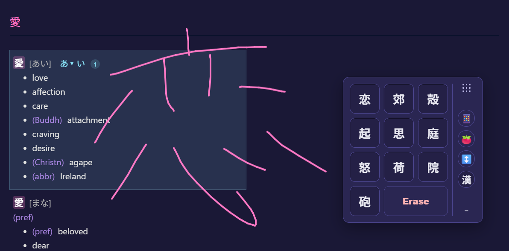
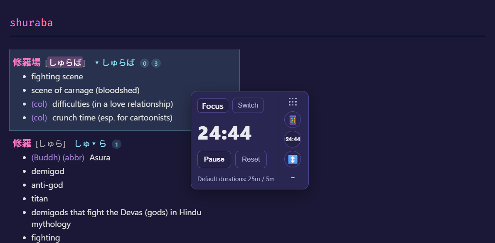
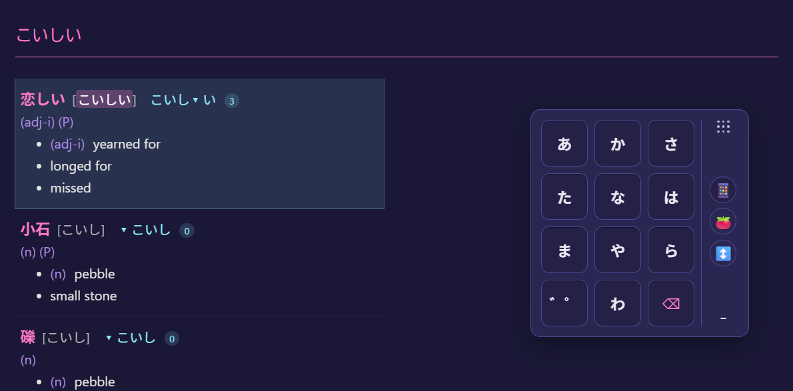

# YomiHelper (読みヘルパ)

When reading Japanese (novels, newspapers, blogs), constantly switching to a separate dictionary kills flow. YomiHelper aims to keep you in the zone by making lookups smooth and efficient with minimal context switching.







YomiHelper is a touch-friendly Japanese dictionary lookup with full-screen handwriting and a Floating Tools panel (T9 keyboard, navigation, Pomodoro). Built once, shipped to Web, Android (Capacitor), and Desktop (Electron).

## Features

- Full-screen kanji handwriting canvas using kanjicanvas; draw anywhere and see candidate kanji in the Floating Tools panel.
- Fast, accurate dictionary lookup with deinflection and pitch accents, powered by japanese-dictionary.
- Floating Tools panel: draggable, dockable (press the "-" button to dock/undock), and hosts all utilities including the T9 keyboard.
- T9 keyboard for kana input (optimized for touch); supports dakuten/handakuten toggles and backspace.
- Pomodoro timer built into the Floating Tools panel.
- Navigation arrows to move through search results; also supports keyboard Up/Down.
- Cross‑platform by design: Vite web app, Capacitor Android, Electron desktop.

## How to use

- Draw anywhere on the screen. Candidate chips appear inside the Floating Tools panel; tap to insert into the search field.
- Open the T9 keyboard in Floating Tools to enter hiragana quickly on touch devices. Long-press/tap the dakuten/handakuten buttons to modify the last kana.
- Drag the Floating Tools panel to reposition it. Press the "-" button to dock/undock it.
- Use the navigation arrows in Floating Tools or your keyboard Up/Down keys to step through search results.
- Prefer typing? Use Romaji (auto-converted to kana) or your OS IME. Results appear on the left as you type.
- The app loads dictionary data on startup; a “Loading dictionary…” notice disappears when ready.

## Powered by

- Kanji recognizer: https://github.com/asdfjkl/kanjicanvas
- Dictionary data and lookup mechanism: https://github.com/bryanjenningz/japanese-dictionary

## Built with CapViteTron (one command, all targets)

This project uses the CapViteTron template to streamline going from code to ready-to-use apps across Web, Android, and Desktop with a single command. If you like this setup, check it out and reuse it for your own apps:

- Template: https://github.com/riozee/capvitetron

Key perks:

- Vite dev server for the web app with fast HMR.
- Capacitor for native Android packaging and APIs.
- Electron + electron-builder for desktop distributions.
- Helper scripts to build and copy final artifacts to the project root.

## Quick start

Prerequisites:

- Node.js 18+ and npm
- For Android builds: Java 17+ and Android SDK/Android Studio
- For Desktop packaging: electron-builder runs on your OS (build on the target OS for best results)

Install dependencies:

```pwsh
npm install
```

Run in the browser (Vite):

```pwsh
npm run dev
```

Build everything (Web -> Android APK + Desktop exe/AppImage/DMG):

```pwsh
npm run build:clean
```

Outputs:

- Web build: `dist/`
- Android debug APK: `android/app/build/outputs/apk/debug/` and copied as `yomihelper-android.apk` to project root
- Desktop builds in `output/` and copied to project root (e.g., `yomihelper-desktop.exe` on Windows)

Other useful scripts:

```pwsh
# Android
npm run build:android      # assemble debug APK via Gradle
npm run open:android       # open Android Studio
npm run start:android      # run on a connected device/emulator

# Desktop
npm run build:desktop      # package desktop app with electron-builder
npm run serve:desktop      # run Electron against the dev server

# Lint
npm run lint
```

## Project structure (high level)

- `src/` – React app (components, dictionary logic, kanji canvas wrapper)
  - `components/` – `FloatingTools.tsx` (dockable panel hosting T9 keyboard, candidate chips, navigation arrows, Pomodoro timer), `KanjiRecognizer.tsx`, `T9Keyboard.tsx`, input and results UI
  - `dictionary/` – deinflection, romaji/kana conversion, search and pitch accent logic
  - `kanjicanvas/` – bundled `kanji-canvas.js` + reference patterns
- `public/dictionaries/` – dictionary payloads loaded at runtime
- `android/` – Capacitor Android project (Gradle)
- `electron/` – Electron main process entry
- `scripts/` – build scripts for Android/Desktop and setup helpers

## Technical notes

- Vite config outputs to `dist/` and serves assets from `./` so Android/Electron can load local files.
- Capacitor config uses `appId: com.riozee.yomihelper` and `appName: YomiHelper`.
- Electron packaging is configured via `electron-builder`’s `build` section in `package.json`.
- UI: the handwriting canvas occupies the full viewport; all tools live in a floating, draggable, dockable panel.
- Dictionary files are fetched from `/dictionaries/*.txt` at runtime. The search pipeline converts Romaji → Hiragana, normalizes Katakana, deinflects, and binary-searches an index file to resolve entries and pitch accents.

## Troubleshooting

- Android build can’t find Java:
  - The postinstall/setup scripts attempt to find Java and provide `scripts/setup-java.ps1` you can run in PowerShell for the current session.
  - Install Temurin JDK 17+ if missing (https://adoptium.net/), then re-run `npm run build:android`.
- Android SDK issues: open the project with `npm run open:android` and let Android Studio install any missing components.
- Dictionary never loads in the browser: ensure the `public/dictionaries/` files exist and are served (they are included in this repo).

## Known issues

- Navigation arrows in Floating Tools cannot currently be clicked with a mouse; use touch or keyboard Up/Down as a workaround.

## Name

Project name: YomiHelper (読みヘルパ).

## Credits and licenses

- Handwriting recognition: asdfjkl/kanjicanvas
- Dictionary engine and data: bryanjenningz/japanese-dictionary
- Template: riozee/capvitetron

Each dependency follows its own license; review upstream projects for details. This repository is licensed under the MIT License — see `LICENSE`.
